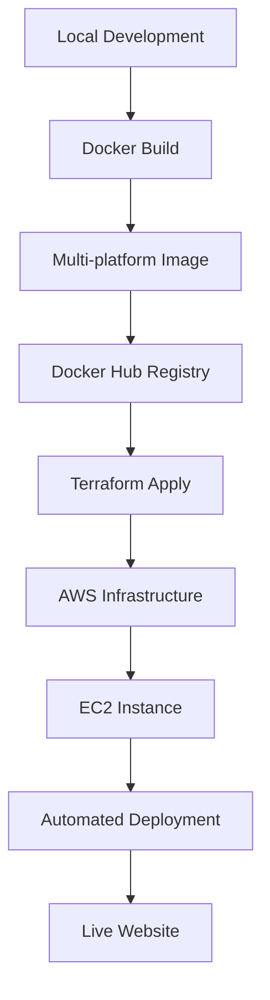

# Portfolio Platform Engineering Project

## 🌐 Live Site
**[jodiecoleman.co.uk](http://jodiecoleman.co.uk)**

A complete platform engineering demonstration showcasing Infrastructure as Code, containerization, and automated deployment practices.

## 🎯 Project Overview

This project demonstrates my transition from Site Reliability Engineer to Platform Engineer by building and deploying a personal portfolio website using modern DevOps practices and cloud-native technologies.

### Key Achievements
- **Complete infrastructure automation** using Terraform
- **Multi-platform containerization** with Docker
- **Production-ready deployment** on AWS
- **Custom domain integration** with DNS management
- **Cost-optimized architecture** (~£3/month)

## 🏗️ Architecture

### Infrastructure Components
- **AWS VPC** with public subnet and internet gateway
- **EC2 t2.micro instance** (free tier eligible)
- **Elastic IP** for consistent public access
- **Security Groups** with HTTP and SSH access
- **Custom domain** with DNS configuration

### Application Stack
- **Frontend**: HTML/CSS with responsive design
- **Backend**: Python Flask application
- **WSGI Server**: Gunicorn for production
- **Containerization**: Docker with multi-platform support
- **Registry**: Docker Hub for image storage

## 🚀 Deployment Pipeline



## 🔧 Technologies Used

### Infrastructure & DevOps
- **Terraform** - Infrastructure as Code
- **AWS** - Cloud platform (VPC, EC2, EIP)
- **Docker** - Containerization
- **GitHub Actions** - CI/CD (planned)

### Application
- **Python Flask** - Web framework
- **Gunicorn** - WSGI HTTP Server
- **HTML/CSS** - Frontend with responsive design
- **Docker Hub** - Container registry

### Domain & DNS
- **IONOS** - Domain registrar
- **DNS A Records** - Custom domain routing

## 📁 Project Structure

```
my-website/
├── app.py                 # Flask application
├── requirements.txt       # Python dependencies
├── Dockerfile            # Container configuration
├── templates/            # HTML templates
│   ├── base.html         # Base template with styling
│   └── index.html        # Main page content
├── infrastructure/       # Terraform configuration
│   ├── main.tf          # AWS resources
│   ├── variables.tf     # Input variables
│   ├── outputs.tf       # Output values
│   ├── user_data.sh     # Instance setup script
│   └── terraform.tfvars # Configuration values
└── README.md            # This file
```

## 🚀 Deployment Instructions

### Prerequisites
- AWS CLI configured with appropriate credentials
- Terraform installed
- Docker installed
- Domain registered (optional)

### 1. Infrastructure Deployment
```bash
cd infrastructure
terraform init
terraform plan
terraform apply
```

### 2. Application Deployment
```bash
# Build multi-platform Docker image
docker buildx build --platform linux/amd64,linux/arm64 -t your-username/portfolio:latest --push .

# Infrastructure automatically pulls and runs the container
```

### 3. Domain Configuration
```bash
# Add A record in your DNS provider
# jodiecoleman.co.uk -> [ELASTIC_IP_FROM_TERRAFORM_OUTPUT]
```

## 💰 Cost Breakdown

| Service | Cost (Monthly) | Notes |
|---------|---------------|-------|
| EC2 t2.micro | £0-2.50 | Free tier: 750 hours/month |
| EBS Storage (8GB) | £0.80 | gp3 volume |
| Elastic IP | £0 | Free while attached |
| Data Transfer | £0 | 1GB/month included |
| **Total** | **£0.80-3.30** | Depends on free tier status |

*Domain: Free first year, ~£10-15/year renewal*

## 🛡️ Security Features

- **Encrypted EBS volumes** for data protection
- **Security Groups** with minimal required access
- **Non-root container user** for application security
- **VPC isolation** with controlled internet access

## 📊 Platform Engineering Skills Demonstrated

### Infrastructure as Code
- Terraform resource management
- AWS provider configuration
- State management and planning
- Infrastructure versioning

### Containerization
- Multi-platform Docker builds
- Production-ready configurations
- Container registry management
- Automated deployments

### Cloud Operations
- AWS networking and security
- Cost optimization strategies
- Resource monitoring and management
- Automated provisioning

### DevOps Practices
- Infrastructure automation
- Container orchestration
- Deployment pipeline design
- Documentation and knowledge sharing

## 🔍 Monitoring & Observability

- **Health check endpoint**: `/health`
- **Application logs**: Docker container logs
- **Infrastructure monitoring**: AWS CloudWatch (ready)
- **Uptime monitoring**: Domain and IP accessibility

## 🎯 Future Enhancements

- [ ] **HTTPS/SSL** with Let's Encrypt
- [ ] **GitHub Actions CI/CD** pipeline
- [ ] **CloudWatch monitoring** and alerting
- [ ] **Auto-scaling group** for high availability
- [ ] **Load balancer** for production readiness
- [ ] **Blue/green deployments**

## 🤝 Professional Context

This project demonstrates my progression from Site Reliability Engineer to Platform Engineer, showcasing:

- **Infrastructure automation** experience
- **Cloud-native architecture** understanding
- **Cost-conscious engineering** decisions
- **Production deployment** capabilities
- **Developer experience** focus

The complete source code, infrastructure definitions, and deployment processes are documented here to demonstrate transparency and knowledge sharing - key aspects of platform engineering culture.

---

*Built by Jodie Coleman - Demonstrating platform engineering excellence through practical implementation.*
